# Basic CI/CD

## Part 1. Настройка gitlab-runner

- Поднял виртуальную машину `Ubuntu Server 22.04 LTS`.

- Скачал и установил на виртуальную машину gitlab-runner командой `sudo apt install gitlab-runner`.

- Запустил gitlab-runner `sudo gitlab-runner start` и зарегистрировал его для использования в текущем проекте `sudo gitlab-runner register`. Подключил репозиторий, добавил токен, описание и теги.

## Part 2. Сборка

### Напиши этап для CI по сборке приложений из проекта C2_SimpleBashUtils.

- В файле gitlab-ci.yml добавил этап запуска сборки через мейк файл из проекта по написанию своей реализацию `cat` и `grep`.

- Файлы, полученные после сборки (артефакты), сохранил в произвольную директорию со сроком хранения 30 дней.

  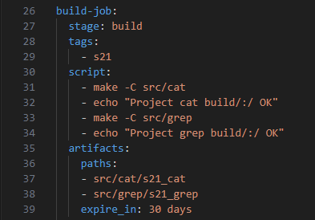 
   
   

## Part 3. Тест кодстайла

### Напиши этап для CI, который запускает скрипт кодстайла (clang-format)

- Если кодстайл не прошел, то пайплайн «зафейлится».

- В пайплайне отобразил вывод утилиты clang-format.

  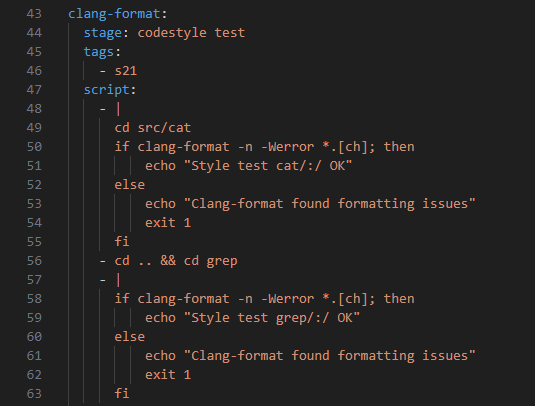 
  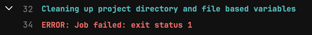 
  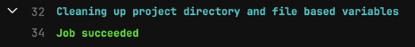 

## Part 4. Интеграционные тесты

### Напиши этап для CI, который запускает твои интеграционные тесты из того же проекта.

- Этот этап запустится автоматически только при условии, что сборка и тест кодстайла прошли успешно.

- Если тесты не прошли, то пайплайн «зафейлится».

- В пайплайне отобразил вывод, что интеграционные тесты успешно прошли/провалились.

  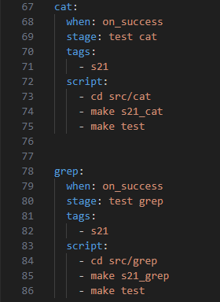 
  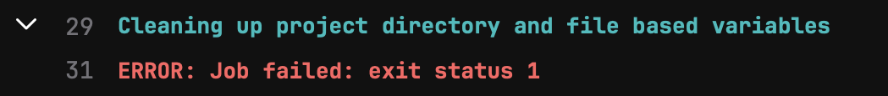 
  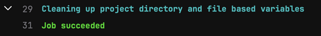 
  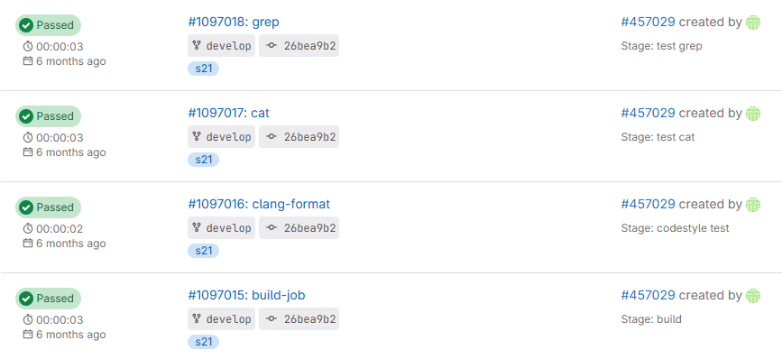 

 

## Part 5. Этап деплоя

- Поднял вторую виртуальную машину `Ubuntu Server 22.04 LTS`.

- Написал этап для CD, который «разворачивает» проект на другой виртуальной машине.

- Запустил этот этап вручную потому, что все предыдущие этапы прошли успешно.

- Написал bash-скрипт, который при помощи `ssh` и `scp` копирует файлы, полученные после сборки (артефакты), в директорию `/usr/local/bin` второй виртуальной машины.

- В файле `gitlab-ci.yml` добавил этап запуска написанного скрипта.

- В случае ошибки пайплайн «зафейлится».

  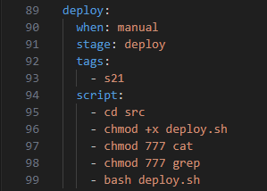 
  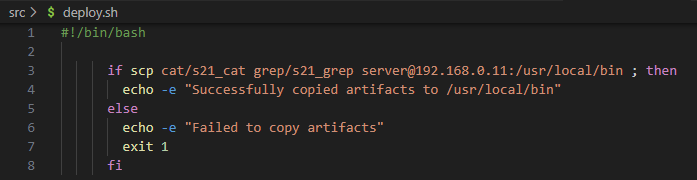 
   
  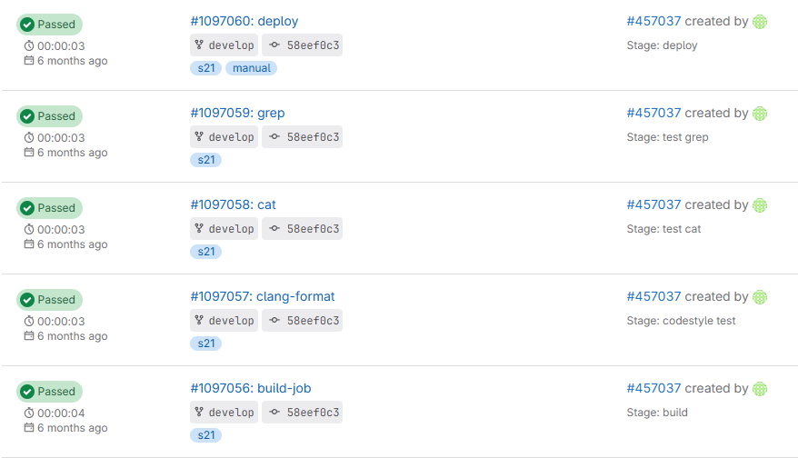 
  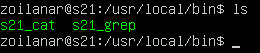 

## Part 6. Дополнительно. Уведомления

- Настроил уведомления об успешном/неуспешном выполнении пайплайна через бота с именем `zoilanar DO6 CI/CD` в Telegram

  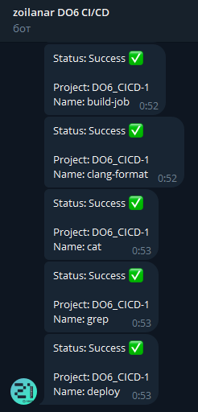  
